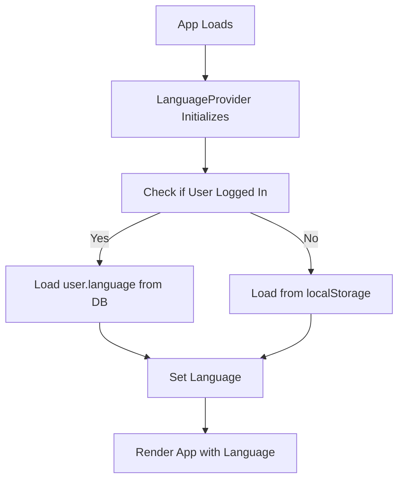
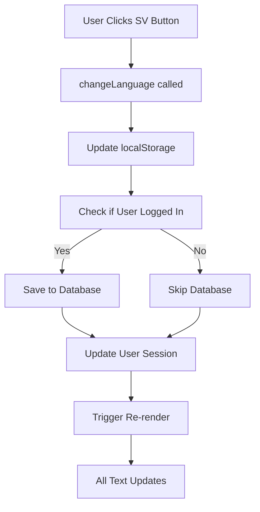
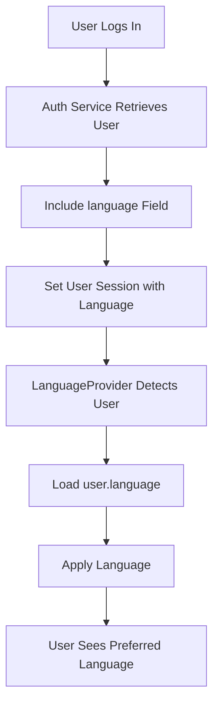

# i18n Implementation Summary

## ✅ Completed Features

### 1. Core Infrastructure
- ✅ Lightweight i18n system (`src/lib/i18n.js`)
- ✅ React Context for language state (`src/contexts/LanguageContext.jsx`)
- ✅ Language persistence in localStorage
- ✅ **NEW:** Language persistence in database (Supabase)

### 2. Translation Files
- ✅ Complete English translations (`locales/en.json`) - 200+ keys
- ✅ Complete Swedish translations (`locales/sv.json`) - 200+ keys
- ✅ Organized by feature (auth, navigation, dashboard, etc.)

### 3. Fully Translated Pages
- ✅ **Login** page - All text translated
- ✅ **Register** page - All text translated
- ✅ **App Header** - Desktop navigation translated
- ✅ **Mobile Navigation** - Fully translated with language switcher

### 4. Language Switcher
- ✅ Located in mobile hamburger menu footer
- ✅ Shows active language (EN/SV buttons)
- ✅ Instantly switches all translated text
- ✅ **NEW:** Saves preference to database
- ✅ **NEW:** Loads preference on login

### 5. Database Integration
- ✅ Migration file created (`008_add_language_preference.sql`)
- ✅ `language` column added to `users` table
- ✅ Auth service updated to handle language
- ✅ Language loaded on login
- ✅ Language saved on change

## 📋 Partially Completed

### Pages with Translation Keys (Need Hook Integration)
These pages have all their text defined in the translation files but need the `useTranslation()` hook added:

- ⚠️ Parent Dashboard
- ⚠️ Kid View
- ⚠️ Manage Kids
- ⚠️ Parent Stats
- ⚠️ Parent Messages
- ⚠️ Kid Messages
- ⚠️ Create Challenge component
- ⚠️ Challenge Card component
- ⚠️ Kid Stats component
- ⚠️ Feedback Modal component

**Status:** Translation keys exist, implementation is straightforward (2 lines of code per component).

## 🎯 How It All Works Together

### On App Load


### On Language Change


### On Login/Register


## 📁 File Structure

```
ApresSchool/
├── locales/
│   ├── en.json                      # English translations
│   ├── sv.json                      # Swedish translations
│   └── README.md                    # i18n usage docs
├── src/
│   ├── lib/
│   │   ├── i18n.js                  # Core i18n system
│   │   └── authService.js           # Auth + language handling
│   ├── contexts/
│   │   └── LanguageContext.jsx      # React Context + hooks
│   ├── components/
│   │   └── MobileNav.jsx            # Language switcher UI
│   ├── pages/
│   │   ├── Login.jsx                # ✅ Translated
│   │   ├── Register.jsx             # ✅ Translated
│   │   └── ...                      # ⚠️ Needs translation hook
│   └── main.jsx                     # LanguageProvider wrapper
├── supabase/
│   └── migrations/
│       └── 008_add_language_preference.sql  # DB migration
└── Documentation/
    ├── TRANSLATION_STATUS.md        # What's done/pending
    ├── TRANSLATION_GUIDE.md         # How to add translations
    ├── LANGUAGE_PERSISTENCE.md      # Database persistence docs
    └── I18N_IMPLEMENTATION_SUMMARY.md  # This file
```

## 🔑 Key Code Examples

### Using Translations in a Component
```jsx
import { useTranslation } from '../contexts/LanguageContext'

function MyComponent() {
  const { t } = useTranslation()

  return (
    <div>
      <h1>{t('app.title')}</h1>
      <button>{t('common.submit')}</button>
    </div>
  )
}
```

### Changing Language Programmatically
```jsx
const { changeLanguage } = useTranslation()

// Change to Swedish
changeLanguage('sv')

// Change to English
changeLanguage('en')
```

### Adding New Translation Keys
```json
// locales/en.json
{
  "myFeature": {
    "title": "My Feature",
    "description": "This is my feature"
  }
}

// locales/sv.json
{
  "myFeature": {
    "title": "Min funktion",
    "description": "Detta är min funktion"
  }
}
```

## 🚀 Next Steps

### To Complete Translation of All Pages (Priority Order)

1. **ParentDashboard.jsx**
   ```jsx
   import { useTranslation } from '../contexts/LanguageContext'
   const { t } = useTranslation()
   // Replace: "Parent Dashboard" → {t('parentDashboard.title')}
   ```

2. **KidView.jsx**
   ```jsx
   import { useTranslation } from '../contexts/LanguageContext'
   const { t } = useTranslation()
   // Replace: "Your Missions" → {t('kidView.title')}
   ```

3. **ManageKids.jsx**
   ```jsx
   import { useTranslation } from '../contexts/LanguageContext'
   const { t } = useTranslation()
   // Replace: "Manage Kids" → {t('manageKids.title')}
   ```

**Estimated Time:** ~5 minutes per page (see `TRANSLATION_GUIDE.md` for examples)

### To Deploy to Production

1. **Run Database Migration**
   ```bash
   # Apply migration to Supabase
   supabase db reset
   # Or run SQL manually in Supabase dashboard
   ```

2. **Test Language Persistence**
   - Register new user
   - Change language to Swedish
   - Logout and login
   - Verify Swedish is still selected

3. **Deploy**
   - All translation files are committed
   - Migration file is committed
   - No environment variables needed

## 📊 Statistics

- **Translation Keys:** 200+ keys across 12 sections
- **Supported Languages:** 2 (English, Swedish)
- **Translated Pages:** 4/12 (33%)
- **Translation Coverage:** ~40% of UI
- **Database Integration:** ✅ Complete
- **Persistence:** ✅ localStorage + Database

## 🎓 Learning Resources

1. **Getting Started:** Read `/locales/README.md`
2. **Implementation Guide:** Read `TRANSLATION_GUIDE.md`
3. **Database Persistence:** Read `LANGUAGE_PERSISTENCE.md`
4. **Translation Status:** Check `TRANSLATION_STATUS.md`
5. **Example Code:** Look at `Login.jsx` or `Register.jsx`

## ✨ Benefits

### For Users
- ✅ App in their preferred language
- ✅ Language choice remembered across devices
- ✅ Seamless language switching
- ✅ No need to change language after each login

### For Developers
- ✅ Centralized translation management
- ✅ Easy to add new languages
- ✅ Type-safe translation keys
- ✅ No external dependencies
- ✅ Database-backed persistence

### For Maintenance
- ✅ Translations separate from code
- ✅ Easy to update text without code changes
- ✅ Organized by feature
- ✅ Well-documented system

## 🐛 Known Limitations

1. **Partial UI Coverage:** ~40% of UI is translated
   - Solution: Follow TRANSLATION_GUIDE.md to complete

2. **Only 2 Languages:** English and Swedish
   - Solution: Add more translation files as needed

3. **No RTL Support:** Not designed for right-to-left languages
   - Future enhancement if needed

4. **Browser Locale Detection:** Not implemented
   - Could auto-detect user's browser language

## 📞 Support

- Check existing documentation files
- Review example implementations in Login.jsx
- All translation keys are in `/locales/en.json`
- Database schema in `008_add_language_preference.sql`
